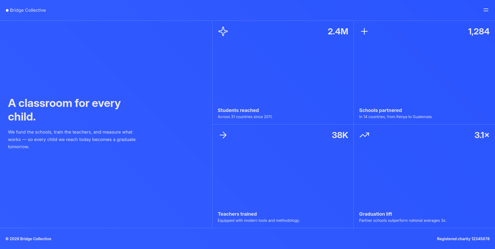

# Frontend Mentor - Grid landing page solution

This is a solution to the [Grid landing page challenge on Frontend Mentor](https://www.frontendmentor.io/challenges/grid-landing-page). Frontend Mentor challenges help you improve your coding skills by building realistic projects. 

## Table of contents

- [Overview](#overview)
  - [The challenge](#the-challenge)
  - [Screenshot](#screenshot)
  - [Links](#links)
  - [Built with](#built-with)

## Overview

### The challenge

Users should be able to:

- View the optimal layout for the page depending on their device's screen size
- See hover and focus states for all interactive elements on the page
- Open and close the navigation menu at any screen size (optional JavaScript)

### Screenshot

### Links

- [Live Site](https://martinica-andrei.github.io/simple-grid-landing-page/)

### Built with

- Semantic HTML5 markup
- CSS custom properties
- Flexbox
- CSS Grid
- Mobile-first workflow